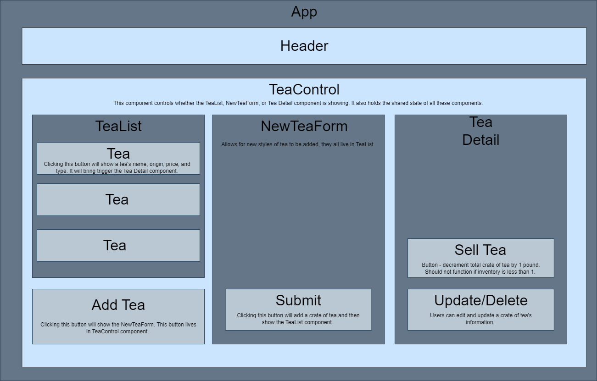

# _Tea Shop_

#### By _**Jake Elsberry**_

#### _A react app for managing inventory of a loose leaf tea shop._

## Technologies Used

* _React.js_
* _Node.js_
* _NodePackageManager(NPM)_
* _Javascript_
* _Html_
* _CSS_

## Description

_This react application is for tracking the inventory of a tea shop. Different varieties can be added, edited, and deleted(full CRUD)._

## Setup/Installation Requirements

1.  _Clone project from [Github repository](https://github.com/Schmelzberry/TeaShop)_

2. _Navigate to the root project directory_

3.  _ From root directory, run the node server with bash command: $ npm start_

## Component Diagram

## Known Bugs

## License

_MIT_

Copyright (c) _9/10/2023_ _Jake Elsberry_